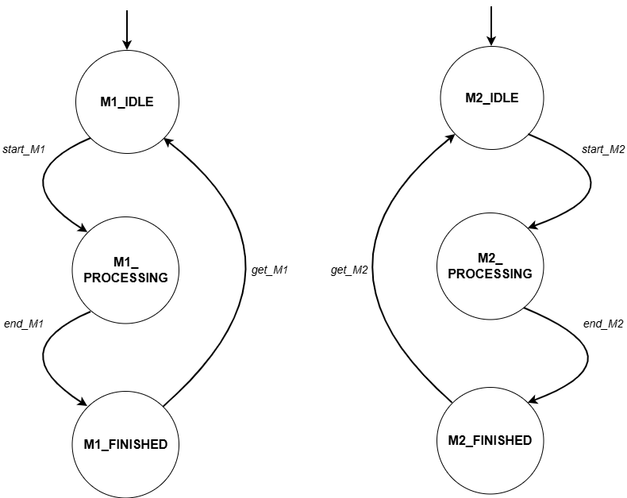

# Modelagem e Controle de Célula de Manufatura Automatizada

## 1. Contexto do Sistema
Este projeto visa a modelagem e a síntese de um supervisor para uma célula de manufatura automatizada, operando sob o paradigma de Sistemas a Eventos Discretos (SED). O sistema é caracterizado pelo compartilhamento de recursos críticos e restrições de capacidade que, sem o devido controle lógico, levam a estados de bloqueio (deadlock) e violação de especificações de segurança.

O objetivo da planta é transformar matéria-prima em produtos acabados através de estações de processamento paralelo, utilizando um robô manipulador para o transporte até uma zona de armazenamento temporário com capacidade finita.

## 2. Arquitetura da Planta

O sistema é composto por 4 subsistemas principais que interagem de forma síncrona:

### Máquinas 1 e 2
As estações de processamento M1 e M2 operam de forma independente, embora possuam lógica de funcionamento idêntica. O ciclo operacional divide-se em três etapas: repouso (IDLE), processamento (PROCESSING) e conclusão (FINISHED). Uma restrição crítica do sistema é que um novo ciclo de produção não pode ser iniciado enquanto a peça finalizada não for removida pelo robô.

### Robô de Transporte
O Robô Industrial atua como o elemento central de transporte da célula, sendo responsável pela transferência das peças manufaturadas das máquinas para o Buffer de saída. Partindo de um estado de repouso(R_IDLE), o robô aguarda a sinalização de conclusão de uma das máquinas (end_M1 ou end_M2). Ao identificar uma peça pronta, ele executa a sequência de deslocamento até a unidade solicitante(R_MOVE_M1 ou R_MOVE_M2), realiza a coleta (get_M1 ou get_M2), transporta o item até o Buffer e efetua o depósito (drop). Concluída a entrega, o robô retorna ao estado livre, ficando disponível para um novo ciclo.

### Armazenamento Intermediário
Responsável por receber os produtos acabados, o Buffer possui uma restrição de capacidade fixa de dois slots. O componente opera sob lógica de rejeição quando cheio: se o número de peças armazenadas igualar a capacidade máxima, qualquer tentativa de depósito pelo robô é bloqueada para evitar transbordamento, gerando um possível gargalo no fluxo produtivo.

